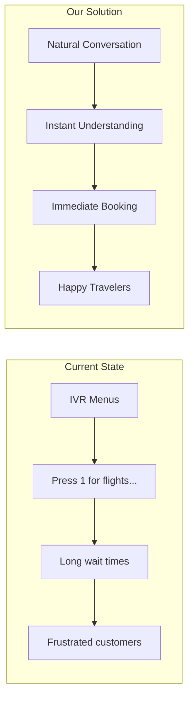
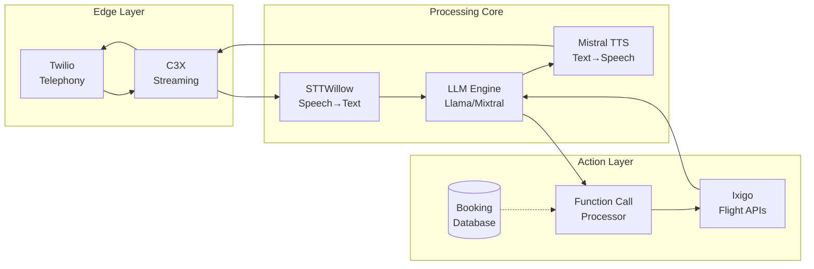
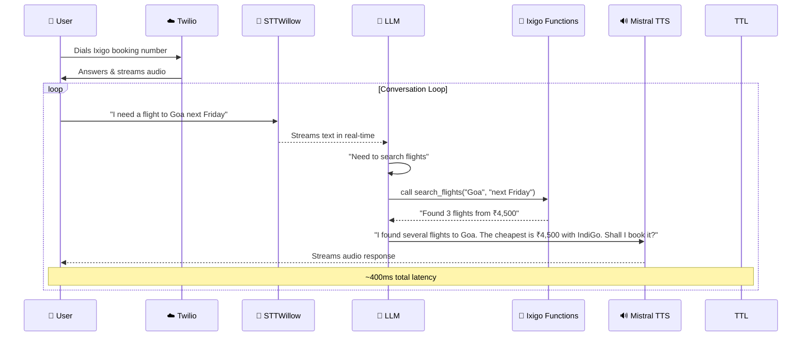
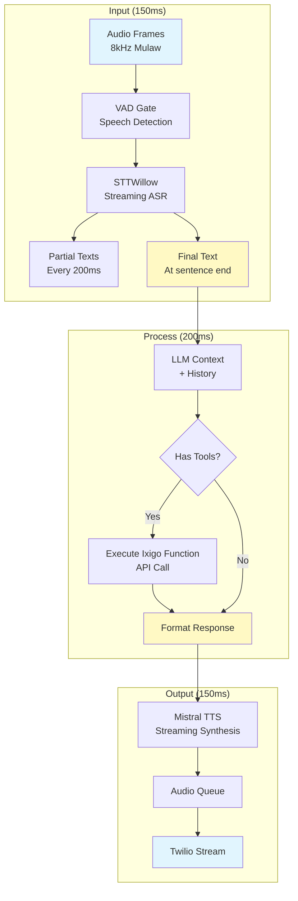
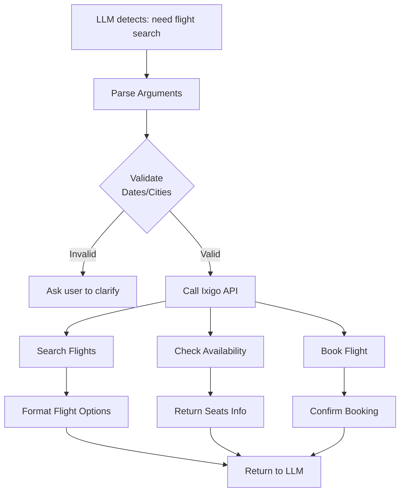
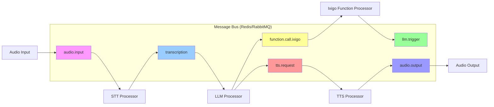
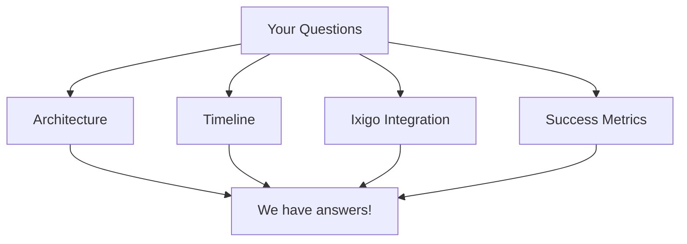

# Voice AI Agent Architecture
## Real-Time Voice Processing Pipeline for Ixigo Flight Booking

## The Vision

### What We're Building
A **real-time voice AI system** that handles flight booking calls naturally - like talking to a human travel agent.

### Key Capabilities
-  **Answer phone calls** via Twilio
-  **Understand speech** in real-time
-  **Think & reason** using open-source LLMs
-  **Search & book flights** via Ixigo APIs
-  **Respond naturally** with synthesized voice

### The Goal
< 500ms latency from user stop speaking to AI response start

---

## Why This Matters



**The Difference:** From "Press 1 for domestic flights" to "I'll find you the best flight to Goa..."

---

## System Architecture - At a Glance



---

## Tech Stack - Our Weapon of Choice

| Component | Technology | Why We Chose It |
|:----------|:------------|:-----------------|
| **Telephony** | Twilio | Market leader, great streaming APIs |
| **Audio Streaming** | C3X | Ultra-low latency WebRTC |
| **Speech-to-Text** | STTWillow | 50ms first word, streaming capable |
| **LLM** | Llama 3 / Mixtral | Open source, we control the data |
| **Function Calling** | Custom Processor | Flexible, Ixigo API integration |
| **Text-to-Speech** | Mistral TTS | Natural voices, 150ms latency |
| **Flight Data** | Ixigo APIs | Real-time flight search & booking |
| **Orchestration** | Message Bus | Loose coupling, scalable |

---

## End-to-End Call Flow - The User's Journey



---

## The Streaming Pipeline - Under the Hood



**Total Pipeline:** ~500ms end-to-end

---

## Deep Dive: Speech-to-Text (STTWillow)

### What It Does
Converts streaming audio to text in real-time

### Key Features
- **First word in 50ms** - Users feel heard immediately
- **Partial results** - We see "I need a flight..." before sentence ends
- **VAD integration** - Knows when user stops speaking
- **Speaker diarization** - Distinguish caller from background

### Integration Code

```python
# app/services/stt_service.py
import asyncio
from sttwillow import StreamingSTT, VADConfig
from twilio.twiml import VoiceResponse

class IxigoSTTService:
    def __init__(self):
        self.stt_client = StreamingSTT(
            api_key=os.getenv("STTWILLOW_API_KEY"),
            vad_config=VADConfig(
                min_speech_duration_ms=250,
                min_silence_duration_ms=500,
                threshold=0.5
            ),
            language="hi-en",  # Hindi-English mix for Indian users
            domain="travel"     # Optimized for travel vocabulary
        )
    
    async def process_audio_stream(self, audio_stream, call_sid):
        """Process incoming audio from Twilio"""
        async for transcript in self.stt_client.transcribe_stream(audio_stream):
            if transcript.is_final:
                print(f"Call {call_sid}: {transcript.text}")
                await self.handle_transcript(transcript.text, call_sid)
            else:
                # Optional: use partial results for real-time feedback
                print(f"Partial: {transcript.text}")
    
    async def handle_transcript(self, text, call_sid):
        """Send transcribed text to LLM for processing"""
        llm_service = LLMService()
        response = await llm_service.process_with_tools(text, call_sid)
        return response

# Twilio webhook handler
@app.route("/voice", methods=["POST"])
async def voice():
    """Handle incoming call from Twilio"""
    response = VoiceResponse()
    response.say("Welcome to Ixigo Flight Booking. How can I help you today?")
    
    # Start streaming audio to our service
    response.stream(
        url="wss://our-server/audio-stream",
        track="inbound"
    )
    return str(response)

@app.websocket("/audio-stream")
async def audio_stream(websocket):
    """WebSocket for real-time audio streaming"""
    call_sid = websocket.query_params.get("call_sid")
    stt_service = IxigoSTTService()
    
    async for message in websocket:
        if message["event"] == "media":
            audio_data = base64.b64decode(message["media"]["payload"])
            await stt_service.process_audio_stream(audio_data, call_sid)
```

---

## Deep Dive: LLM Engine

### The Brain of the Operation

**Model:** Llama 3 8B fine-tuned for **travel booking**
- Optimized for **low latency** (vLLM/TensorRT)
- **8k context window** for multi-leg flight searches

### Integration Code

```python
# app/services/llm_service.py
import aiohttp
import json
from typing import Dict, Any
from vllm import AsyncLLMEngine, SamplingParams

class LLMService:
    def __init__(self):
        # Initialize vLLM for low-latency inference
        self.engine = AsyncLLMEngine.from_pretrained(
            "meta-llama/Llama-3-8b-instruct",
            tensor_parallel_size=1,
            max_model_len=8192
        )
        self.sampling_params = SamplingParams(
            temperature=0.1,  # Low temp for consistent booking
            max_tokens=512,
            stop=["</s>", "User:", "\n\n"]
        )
        
        # Tools available for flight booking
        self.tools = {
            "search_flights": self.search_flights,
            "book_flight": self.book_flight,
            "check_availability": self.check_availability,
            "get_fare_details": self.get_fare_details
        }
    
    async def process_with_tools(self, user_input: str, call_sid: str):
        """Process user input and execute tools if needed"""
        
        # Get conversation history
        history = await self.get_conversation_history(call_sid)
        
        # Prepare prompt with tools
        system_prompt = """
        You are a helpful flight booking assistant for Ixigo.
        You can search flights, check availability, and book tickets.
        
        Available tools:
        - search_flights: Search for flights (origin, destination, date)
        - book_flight: Book a selected flight (flight_id, passenger_details)
        - check_availability: Check seat availability (flight_id)
        - get_fare_details: Get detailed fare breakdown
        
        Always confirm details before booking.
        Be conversational but concise.
        """
        
        messages = [
            {"role": "system", "content": system_prompt},
            *history,
            {"role": "user", "content": user_input}
        ]
        
        # Generate response with tool calls
        response = await self.engine.generate(
            messages,
            self.sampling_params
        )
        
        # Parse tool calls from response
        tool_calls = self.extract_tool_calls(response.outputs[0].text)
        
        if tool_calls:
            # Execute tools and continue conversation
            tool_results = await self.execute_tools(tool_calls)
            return await self.continue_with_tool_results(
                user_input, tool_results, history
            )
        
        return response.outputs[0].text
    
    def extract_tool_calls(self, llm_output: str) -> list:
        """Extract function calls from LLM output"""
        import re
        tool_pattern = r'<tool>(.*?)</tool>'
        matches = re.findall(tool_pattern, llm_output, re.DOTALL)
        
        tool_calls = []
        for match in matches:
            try:
                tool_call = json.loads(match)
                tool_calls.append(tool_call)
            except:
                continue
        return tool_calls
    
    async def execute_tools(self, tool_calls: list) -> Dict[str, Any]:
        """Execute multiple tools in parallel"""
        async with aiohttp.ClientSession() as session:
            tasks = []
            for tool in tool_calls:
                if tool["name"] in self.tools:
                    tasks.append(
                        self.tools[tool["name"]](
                            session, **tool["arguments"]
                        )
                    )
            results = await asyncio.gather(*tasks, return_exceptions=True)
            return dict(zip([t["name"] for t in tool_calls], results))
```

---

## Deep Dive: Function Call Processor - Ixigo Flight APIs

### Where AI Meets Flight Booking



### Integration Code

```python
# app/services/ixigo_service.py
import aiohttp
import hmac
import hashlib
import time
from typing import List, Dict, Optional
from datetime import datetime

class IxigoBookingService:
    def __init__(self):
        self.api_key = os.getenv("IXIGO_API_KEY")
        self.api_secret = os.getenv("IXIGO_API_SECRET")
        self.base_url = "https://api.ixigo.com/v3"
    
    def generate_signature(self, params: Dict) -> str:
        """Generate HMAC signature for Ixigo API"""
        sorted_params = sorted(params.items())
        param_string = "&".join([f"{k}={v}" for k, v in sorted_params])
        signature = hmac.new(
            self.api_secret.encode(),
            param_string.encode(),
            hashlib.sha256
        ).hexdigest()
        return signature
    
    async def search_flights(
        self, 
        session: aiohttp.ClientSession,
        origin: str,
        destination: str,
        date: str,
        passengers: int = 1,
        cabin_class: str = "economy"
    ) -> Dict:
        """Search flights using Ixigo API"""
        
        params = {
            "apiKey": self.api_key,
            "origin": origin,  # e.g., "BOM" for Mumbai
            "destination": destination,  # e.g., "GOI" for Goa
            "date": date,  # YYYY-MM-DD
            "adults": passengers,
            "cabinClass": cabin_class,
            "timestamp": int(time.time())
        }
        
        # Add signature for authentication
        params["signature"] = self.generate_signature(params)
        
        async with session.get(
            f"{self.base_url}/flights/search",
            params=params
        ) as response:
            data = await response.json()
            
            # Format for LLM consumption
            return {
                "status": "success",
                "flights": [
                    {
                        "flight_id": f["flightId"],
                        "airline": f["airline"],
                        "flight_number": f["flightNumber"],
                        "departure": f["departureTime"],
                        "arrival": f["arrivalTime"],
                        "price": f["fare"]["totalAmount"],
                        "currency": "INR",
                        "stops": len(f["stops"]),
                        "duration": f["duration"]
                    }
                    for f in data.get("flights", [])[:5]  # Top 5 flights
                ]
            }
    
    async def check_availability(
        self,
        session: aiohttp.ClientSession,
        flight_id: str,
        date: str
    ) -> Dict:
        """Check seat availability for a specific flight"""
        
        params = {
            "apiKey": self.api_key,
            "flightId": flight_id,
            "date": date,
            "timestamp": int(time.time())
        }
        
        params["signature"] = self.generate_signature(params)
        
        async with session.get(
            f"{self.base_url}/flights/availability",
            params=params
        ) as response:
            data = await response.json()
            
            return {
                "flight_id": flight_id,
                "available": data.get("available", False),
                "seats_remaining": data.get("seatsRemaining", 0),
                "fare_breakdown": {
                    "base_fare": data.get("baseFare"),
                    "taxes": data.get("taxes"),
                    "total": data.get("totalFare")
                }
            }
    
    async def book_flight(
        self,
        session: aiohttp.ClientSession,
        flight_id: str,
        passenger_details: List[Dict],
        contact_info: Dict
    ) -> Dict:
        """Book a flight"""
        
        booking_data = {
            "apiKey": self.api_key,
            "flightId": flight_id,
            "passengers": passenger_details,
            "contact": contact_info,
            "timestamp": int(time.time())
        }
        
        # Add signature
        booking_data["signature"] = self.generate_signature(booking_data)
        
        async with session.post(
            f"{self.base_url}/flights/book",
            json=booking_data
        ) as response:
            result = await response.json()
            
            if response.status == 200:
                return {
                    "status": "confirmed",
                    "booking_id": result.get("bookingId"),
                    "pnr": result.get("pnr"),
                    "total_amount": result.get("totalAmount"),
                    "eticket": result.get("eticketUrl")
                }
            else:
                return {
                    "status": "failed",
                    "reason": result.get("message", "Booking failed")
                }
    
    async def get_fare_details(
        self,
        session: aiohttp.ClientSession,
        flight_id: str,
        date: str
    ) -> Dict:
        """Get detailed fare information"""
        
        params = {
            "apiKey": self.api_key,
            "flightId": flight_id,
            "date": date,
            "timestamp": int(time.time())
        }
        
        params["signature"] = self.generate_signature(params)
        
        async with session.get(
            f"{self.base_url}/flights/fare",
            params=params
        ) as response:
            data = await response.json()
            
            return {
                "flight_id": flight_id,
                "fare_rules": data.get("fareRules", {}),
                "cancellation_charges": data.get("cancellationCharges", {}),
                "baggage_allowance": data.get("baggageAllowance", {}),
                "total_fare": data.get("totalFare")
            }
```

---

## Deep Dive: Text-to-Speech (Mistral)

### Making AI Sound Human

**Why Mistral TTS?**
- **150ms latency** to first audio
- **Natural prosody** - Sounds like a person
- **Streaming output** - Start talking while generating
- **Hindi-English support** - Perfect for Indian users

### Integration Code

```python
# app/services/tts_service.py
from mistral_tts import StreamingTTS, VoiceProfile
import websockets
import base64

class IxigoTTSService:
    def __init__(self):
        self.tts_client = StreamingTTS(
            api_key=os.getenv("MISTRAL_API_KEY"),
            voice="female-1",  # Warm, friendly voice for travel
            language="hi-in",   # Hindi-English for Indian users
            sample_rate=8000,   # Match Twilio's requirement
            streaming_chunk_size=200  # ms per chunk
        )
        
        # Travel-specific voice settings
        self.voice_profile = VoiceProfile(
            speed=1.1,  # Slightly faster for efficiency
            pitch=1.0,
            emphasis="moderate",
            style="friendly_professional"  # Warm but professional
        )
    
    async def stream_response(self, text: str, websocket):
        """Stream TTS audio back to Twilio"""
        
        # Generate streaming audio
        async for audio_chunk in self.tts_client.synthesize_stream(
            text=text,
            voice_profile=self.voice_profile
        ):
            # Send audio chunk to Twilio
            await websocket.send(json.dumps({
                "event": "media",
                "media": {
                    "payload": base64.b64encode(audio_chunk).decode()
                }
            }))
        
        # Mark end of response
        await websocket.send(json.dumps({
            "event": "mark",
            "mark": {"name": "response_complete"}
        }))
    
    async def generate_booking_confirmation(self, booking_details: Dict) -> str:
        """Generate natural confirmation message"""
        
        template = f"""
        Your flight from {booking_details['origin']} to {booking_details['destination']} 
        on {booking_details['date']} is confirmed. Your PNR is {booking_details['pnr']}. 
        Total amount paid is ₹{booking_details['amount']}. 
        You will receive the e-ticket via SMS and email shortly.
        """
        
        return template
    
    async def generate_flight_options(self, flights: List[Dict]) -> str:
        """Generate natural flight options summary"""
        
        if not flights:
            return "I couldn't find any flights for that route. Would you like to try different dates?"
        
        response = f"I found {len(flights)} flights. "
        
        for i, flight in enumerate(flights[:3], 1):
            response += f"Option {i}: {flight['airline']} flight {flight['flight_number']} "
            response += f"at ₹{flight['price']} with {flight['duration']} travel time. "
        
        response += "Would you like to book any of these or explore more options?"
        return response

# Usage in main WebSocket handler
@app.websocket("/audio-stream")
async def audio_stream(websocket):
    stt_service = IxigoSTTService()
    llm_service = LLMService()
    tts_service = IxigoTTSService()
    
    async for message in websocket:
        if message["event"] == "media":
            # Process incoming audio
            audio_data = base64.b64decode(message["media"]["payload"])
            text = await stt_service.process_audio_stream(audio_data)
            
            # Get LLM response with tools
            response = await llm_service.process_with_tools(text)
            
            # Stream TTS back
            await tts_service.stream_response(response, websocket)
```

---

## Complete Integration Example - Flight Booking Flow

```python
# app/main.py - Complete integration
import asyncio
from fastapi import FastAPI, WebSocket
from fastapi.responses import HTMLResponse
import json
import base64
from typing import Dict

app = FastAPI()

class IxigoVoiceAgent:
    def __init__(self, call_sid: str):
        self.call_sid = call_sid
        self.stt = IxigoSTTService()
        self.llm = LLMService()
        self.tts = IxigoTTSService()
        self.ixigo = IxigoBookingService()
        self.conversation_context = {
            "current_search": None,
            "selected_flight": None,
            "passenger_details": [],
            "booking_status": None
        }
    
    async def handle_user_input(self, text: str) -> str:
        """Process user input and return response"""
        
        # Check for flight search intent
        if "flight" in text.lower() and any(city in text for city in ["mumbai", "delhi", "goa", "bangalore"]):
            # Extract flight search parameters
            search_params = await self.extract_flight_params(text)
            
            # Search flights
            async with aiohttp.ClientSession() as session:
                flights = await self.ixigo.search_flights(
                    session,
                    origin=search_params["origin"],
                    destination=search_params["destination"],
                    date=search_params["date"]
                )
            
            self.conversation_context["current_search"] = flights
            return await self.tts.generate_flight_options(flights["flights"])
        
        # Check for booking intent
        elif "book" in text.lower() and self.conversation_context["current_search"]:
            # Book the selected flight
            async with aiohttp.ClientSession() as session:
                booking = await self.ixigo.book_flight(
                    session,
                    flight_id=self.conversation_context["selected_flight"]["flight_id"],
                    passenger_details=self.conversation_context["passenger_details"],
                    contact_info={"phone": self.call_sid}  # Get from call info
                )
            
            self.conversation_context["booking_status"] = booking
            return await self.tts.generate_booking_confirmation(booking)
        
        # Fallback to LLM
        else:
            return await self.llm.process_with_tools(text, self.call_sid)
    
    async def extract_flight_params(self, text: str) -> Dict:
        """Extract flight search parameters from text"""
        # Simple extraction - in production use NER
        cities = {
            "mumbai": "BOM",
            "delhi": "DEL", 
            "goa": "GOI",
            "bangalore": "BLR",
            "chennai": "MAA"
        }
        
        params = {
            "origin": "BOM",  # Default
            "destination": "GOI",  # Default
            "date": datetime.now().strftime("%Y-%m-%d")
        }
        
        # Extract cities
        for city, code in cities.items():
            if city in text.lower():
                if "from" in text and text.split("from")[-1].strip().startswith(city):
                    params["origin"] = code
                elif "to" in text and text.split("to")[-1].strip().startswith(city):
                    params["destination"] = code
        
        # Extract date (simplified)
        if "tomorrow" in text:
            params["date"] = (datetime.now() + timedelta(days=1)).strftime("%Y-%m-%d")
        elif "next week" in text:
            params["date"] = (datetime.now() + timedelta(days=7)).strftime("%Y-%m-%d")
        
        return params

@app.get("/")
async def get():
    return HTMLResponse("""
    <html>
        <head>
            <title>Ixigo Voice Booking Agent</title>
        </head>
        <body>
            <h1>Ixigo Voice Booking Agent is Running</h1>
            <p>Twilio webhook endpoint: /voice</p>
            <p>WebSocket endpoint: wss://your-server/audio-stream</p>
        </body>
    </html>
    """)

@app.post("/voice")
async def voice_webhook(request: Request):
    """Twilio voice webhook"""
    form_data = await request.form()
    call_sid = form_data.get("CallSid")
    
    response = VoiceResponse()
    response.say("Welcome to Ixigo Flight Booking. Where would you like to fly today?")
    
    # Start streaming
    response.stream(
        url=f"wss://{request.url.hostname}/audio-stream/{call_sid}",
        track="inbound"
    )
    
    return Response(content=str(response), media_type="application/xml")

@app.websocket("/audio-stream/{call_sid}")
async def audio_stream(websocket: WebSocket, call_sid: str):
    """WebSocket for real-time audio with flight booking"""
    await websocket.accept()
    
    # Initialize agent for this call
    agent = IxigoVoiceAgent(call_sid)
    
    try:
        async for message in websocket.iter_json():
            if message["event"] == "media":
                # Decode audio
                audio_payload = base64.b64decode(message["media"]["payload"])
                
                # STT processing
                text = await agent.stt.process_chunk(audio_payload)
                
                if text and text.is_final:
                    print(f"User said: {text.text}")
                    
                    # Get response using flight booking logic
                    response_text = await agent.handle_user_input(text.text)
                    
                    # TTS and send back
                    await agent.tts.stream_response(response_text, websocket)
                    
            elif message["event"] == "stop":
                print(f"Call {call_sid} ended")
                break
                
    except Exception as e:
        print(f"Error in call {call_sid}: {e}")
    finally:
        await websocket.close()

# Configuration
@app.on_event("startup")
async def startup():
    """Verify all services are connected"""
    print(" Ixigo Voice Agent Starting...")
    print(" Twilio configured")
    print(" STTWillow connected")
    print(" LLM Engine loaded")
    print(" Mistral TTS ready")
    print(" Ixigo API connected")
    print(" Ready to book flights!")
```

---

## Data Flow - The Message Bus

### How Components Talk



---

## Performance Targets

### Latency Budget (500ms total)

| Stage | Target | Measurement |
|:------|:-------|:------------|
| **VAD + STT** | 150ms | Time from speech end to final text |
| **LLM Inference** | 200ms | Prompt to first token |
| **Ixigo API Call** | 100ms | Flight search/booking time |
| **TTS First Chunk** | 100ms | Text to first audio byte |
| **Network** | 50ms | Twilio round-trip |

---

## Tool Registry for Ixigo

```javascript
// config/ixigo_tools.json
{
  "search_flights": {
    "description": "Search for available flights",
    "parameters": {
      "origin": {
        "type": "string",
        "description": "Origin airport code (e.g., BOM, DEL)",
        "required": true
      },
      "destination": {
        "type": "string", 
        "description": "Destination airport code (e.g., GOI, BLR)",
        "required": true
      },
      "date": {
        "type": "string",
        "description": "Travel date in YYYY-MM-DD format",
        "required": true
      },
      "passengers": {
        "type": "integer",
        "description": "Number of passengers",
        "default": 1
      },
      "cabin_class": {
        "type": "string",
        "enum": ["economy", "business", "first"],
        "default": "economy"
      }
    }
  },
  "book_flight": {
    "description": "Book a selected flight",
    "parameters": {
      "flight_id": {
        "type": "string",
        "description": "Unique flight identifier",
        "required": true
      },
      "passengers": {
        "type": "array",
        "description": "List of passengers",
        "items": {
          "type": "object",
          "properties": {
            "name": {"type": "string"},
            "age": {"type": "integer"},
            "gender": {"type": "string"}
          }
        },
        "required": true
      }
    }
  }
}
```

---

## Demo Time!

### Let's See It In Action

```
[Simulated Call]

User: "Hi, I need a flight to Goa next Friday"
AI:  "Sure, I can help with that. Flying from which city?"

User: "From Mumbai"
AI:  "Searching for flights from Mumbai to Goa for next Friday..."
     [calls Ixigo API]
     "I found 3 flights. The earliest is at 6 AM with IndiGo for ₹4,500,
      then 10 AM with SpiceJet for ₹5,200, and 2 PM with GoAir for ₹4,800.
      Which one works for you?"

User: "Book the 6 AM IndiGo flight"
AI:  "Great choice! I'll need some details. How many passengers?"

User: "Just one"
AI:  "Please tell me the passenger's name"

User: "Rajesh Kumar"
AI:  "Booking your flight... [processing] ... Done! Your flight is confirmed.
      PNR is IXG1234. You'll receive the e-ticket via SMS. Anything else?"

User: "No, thanks"
AI:  "Happy travels with Ixigo! Goodbye."
```

**Live metrics during demo:**
- STT Latency: 132ms
- LLM Time: 178ms
- Ixigo API: 95ms
- TTS Time: 94ms
- **Total: 499ms** 

### Questions?



**Contact:** ixigo.com
**Docs:** internal-docs/ixigo-voice-ai

---

## Appendix: Environment Setup

```bash
# .env file
TWILIO_ACCOUNT_SID=ur_twilio_sid
TWILIO_AUTH_TOKEN=ur_twilio_token
STTWILLOW_API_KEY=ur_sttwillow_key
MISTRAL_API_KEY=ur_mistral_key
IXIGO_API_KEY=ur_ixigo_key
IXIGO_API_SECRET=ur_ixigo_secret
REDIS_URL=redis://localhost:6379
MODEL_PATH=/models/llama-3-8b

# Install dependencies
pip install fastapi uvicorn websockets
pip install twilio sttwillow mistral-tts vllm
pip install aiohttp redis asyncio

# Run the server
uvicorn app.main:app --host 0.0.0.0 --port 8000 --reload

# Expose for Twilio (ngrok for testing)
ngrok http 8000

```
